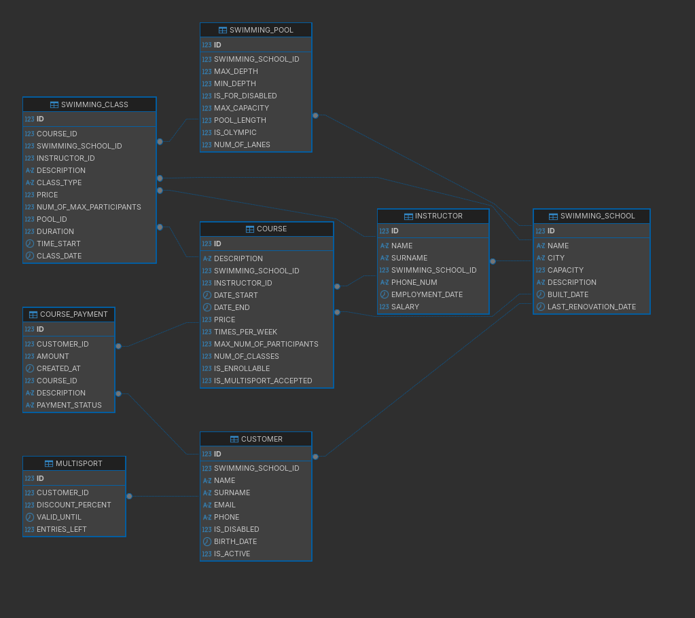
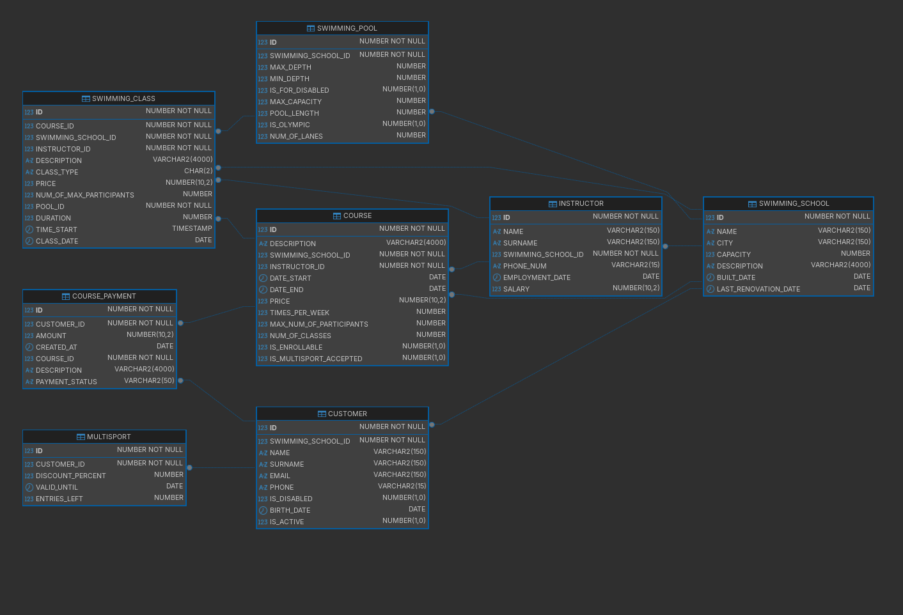

docker image used: https://hub.docker.com/r/gvenzl/oracle-xe

## Useful docker commands

- sudo systemctl start docker
- docker compose up -d
- docker compose down
- docker compose down -v
- docker ps
- docker exec -it oracle-xe-21 sqlplus `user`/`password`@//localhost:1521/`db`
- docker logs -f oracle-xe-21

## Useful Oracle commands

- SELECT table_name FROM user_tables;
- DESCRIBE table_name;
- EXIT;

## Note

Docker should run the init script, if it doesn't, please copy and paste it.

## Screenshots

The diagram below shows the database. Tool: DBeaver.

And here is a more descriptive diagram with types and nullability:

