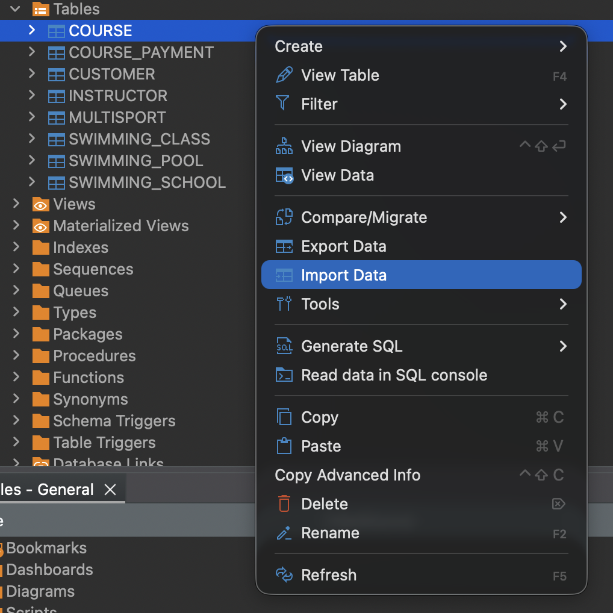
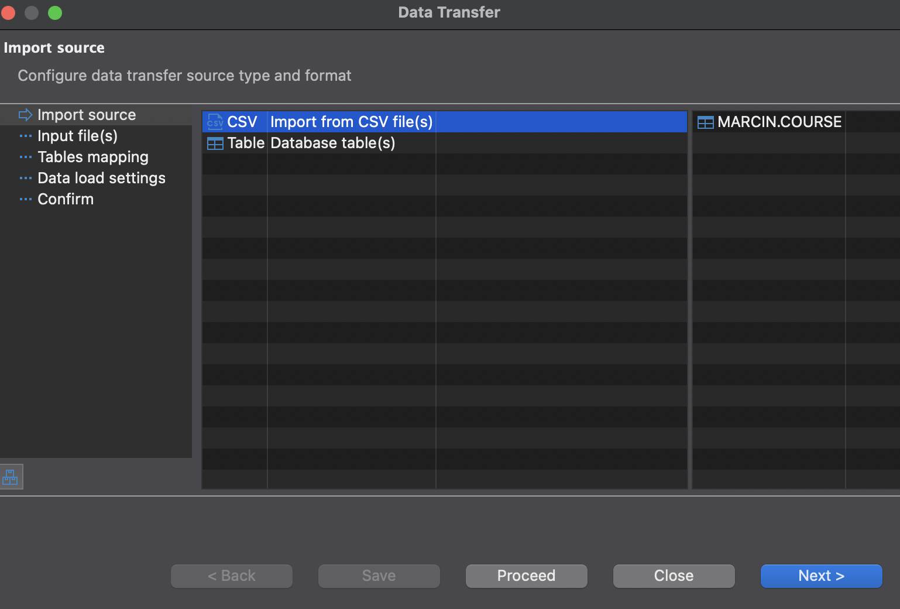
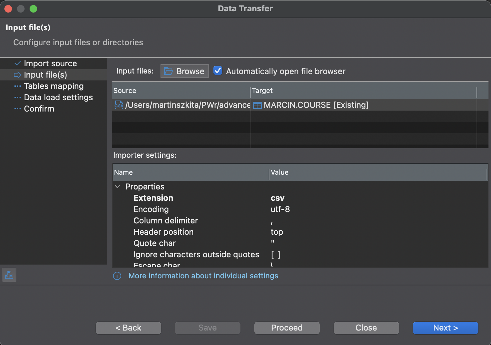

# Steps to insert the csv data into the databse using DBeaver
1. download the files from the *data-for-db-import* folder
2. create the tables in the databse without primary or foreign keys using *create-tables.sql* script
3. manually insert the csv data, path: *schemas*/*your_db_username*/*tables*

## right click on the name of the table and select *import data*

## select csv import and choose the right file

## click next until the final window

## finally click *Proceed*

4. Repeat this for every table
5. Chech if the tables are filled with data
6. Run *add-primary-keys.sql* script
7. Run *add-foreign-key.sql* script
8. Run *test.sql* to check if the relations work